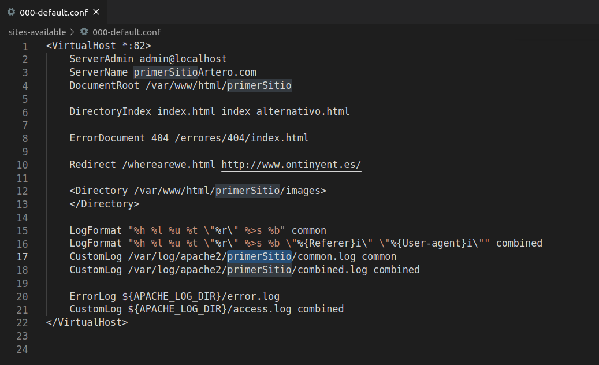
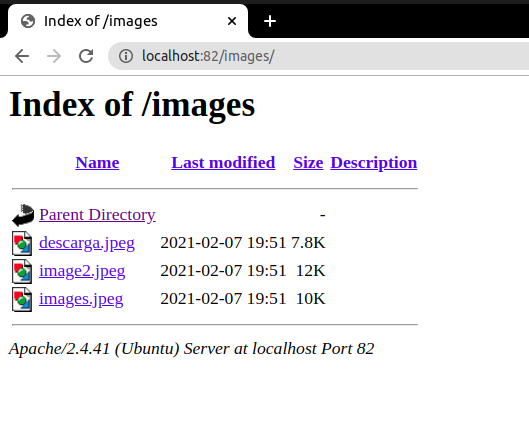
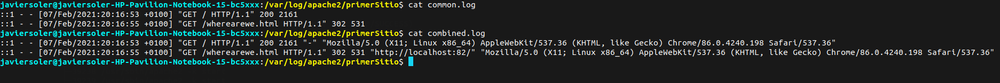

# Ejercicio 3 de apache

### Archivo conf

Se han añadido varias nuevas directivas:

- Directory: donde se especifica un nuevo directorio y si el usuario accede a este se listará el contenido.

- LogFormat: establece el formato de los logs tanto de common como combined.

- CustomLog: permite establecer un log personalizado, en este caso son dos, uno para el common que se guardará en /var/log/apache/primerSitio/common.log con el formato de common previamente establecido y otro con el formato de combined en el archivo de la ruta /var/log/apache/primerSitio/combined.log

En esta imagen se puede observar que tras un periodo de uso de la página, los logs se han actualizado.