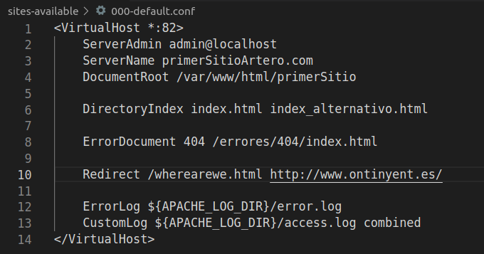
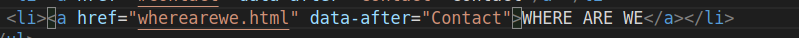

# Ejercicio 2 apache

### Archivo de configuración

Como se puede observar se han añadido dos directivas:

- ErrorDocument: Que especifica la ruta del archivo donde estará la pagina de error que se mostrará en el caso de que el usuario haga una petición que no sea correspondida con ninguna ruta del servidor.

- Redirect: Define una redirección a la página www.ontinyent.es cuando el usuario intente acceder a la página /wearewe.html

En el header estará el nuevo apartado donde clicará el usuario para ir a la página wearewe.html redireccionada a la página del ayuntamiento de ontinyent.

