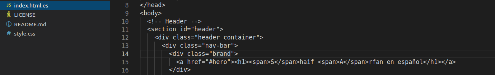
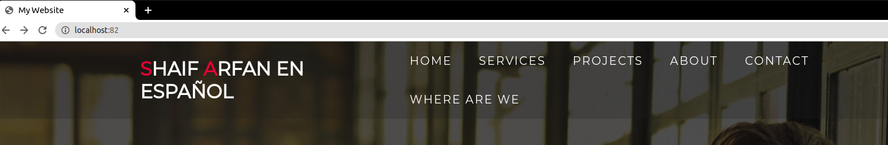
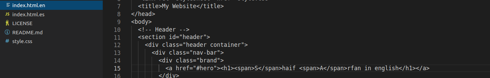
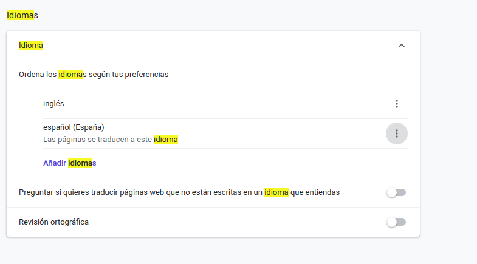

# Ejercicio 4 de apache

### Archivo conf

Se ha añadido una directiva al directorio de primerSitio para que se habilite las multiviews dependiendo del idioma en el que esté el navegador se pueda visualizar un archivo html u otro.

#### Español

Este archivo html será el que se visualizará cuando el navegador tenga por defecto el idioma español seleccionado.

Cambio al español.

Visualización de este.

#### Ingles

Este archivo html será el que se visualizará cuando el navegador tenga por defecto el idioma inglés seleccionado.

Cambio al inglés.

Visualización de este.

