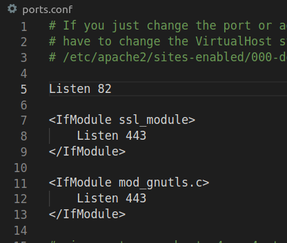
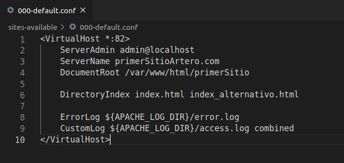
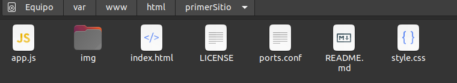

# Primer ejercicio de apache

### Contenido de ports.conf

Como se puede observar se van a escuchar las peticiones del puerto 82

### Contenido de 000default.conf

El host virtual estará en el puerto 82. El correo del administrador del servidor será admin@localhost.com y la página principal será index.html. En el caso que esta no exista, será index_alternativo.html.

### Contenido de la página web

Contenido clonado de este [repositorio](https://github.com/WebCifar/one-page-website-html-css-project-for-practice.git)
